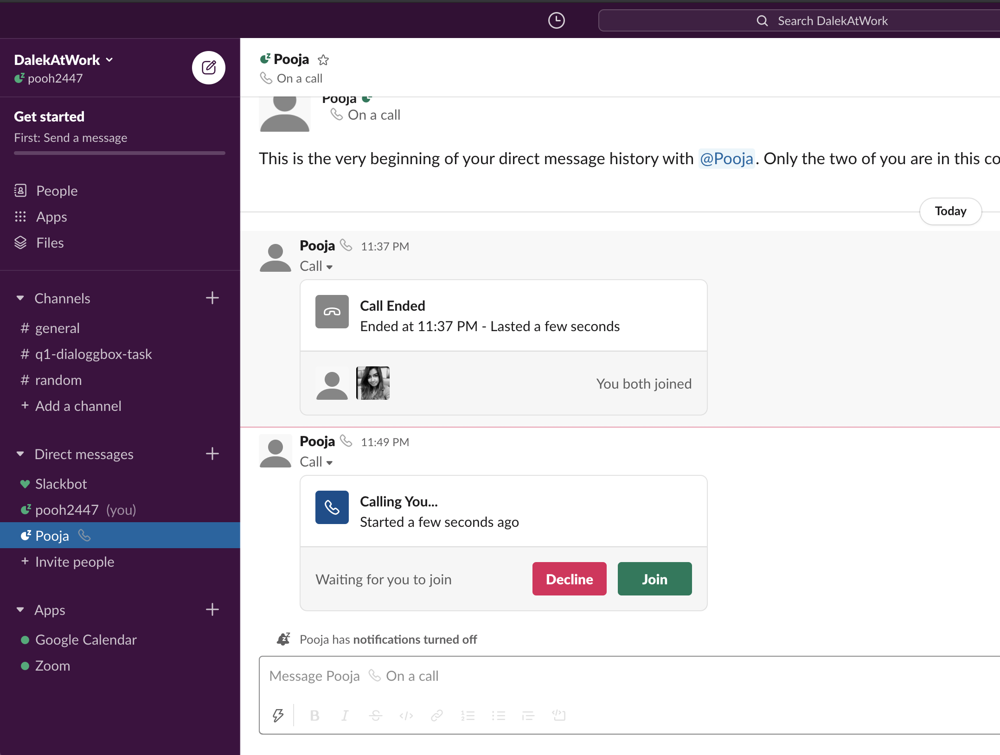

# Report

This report tackles 3 major items

* Slack's handling of calls
* Conversation Transcript
* Conversation Summaries

## Slack's handling of calls

Note: Setup for enabling calls on Slack

1. Select Settings & administration
2. Workspace settings from the menu
3. Next to Calls, click Expand. Make sure the box is checked next to Allow phone number calls in Slack (only in direct messages).
4. Under Calling options, check the boxes next to the apps you'd like to access by clicking on the phone icon.

### Direct calling between slack members (Can be default enabled for all users)

1. This appears as a widget in your chat window.

2. Incase you join it, it **opens up in a new tab**
3. When meeting ends, no call summary or recording is returned. Just the status of the meeting widget changes reflecting the call status with duration.

### Calls using third party apps(can be default enabled only for Paid Users)

1. You can make the calls with Zoom, and other third party using command line tools provided. 
2. At the end of the call it returns Summary and call recordings, if any. [Documentation](https://zoomappdocs.docs.stoplight.io/slack-app#meeting-summary-and-recording-link)

## Conversation Transcript

From the initial looks at the different features that each of the items provide, this seems like what we would like to replicate [Demo Content](https://youtu.be/aa4jMBJRQx8?t=35)

